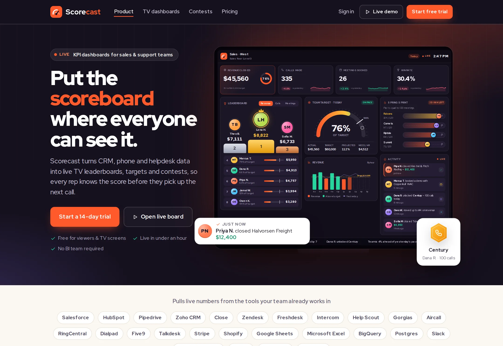

# Scorecast

Live KPI dashboards for sales and support teams: TV-mode leaderboards, targets vs actual, gamified contests and real-time win alerts.

**Live demo:** https://www.freelancerportfoliohub.com/jameslee/projects/scorecast/index.html



## Overview

Scorecast puts the scoreboard where the whole floor can see it. It turns CRM, dialer and helpdesk activity into boards
designed for distance reading: a podium leaderboard, KPI tiles with deltas and sparklines, a target gauge with pacing,
hourly and burn-up charts, race-track and bracket contests, and a live activity feed with a ticker along the bottom.

This repository contains the marketing site and the board UI. The board at `/demo` is fully interactive: switch
between three teams, three date ranges and each team's leaderboard metrics, or start TV rotation to cycle through them
the way a wall screen does.

## Features

- **TV board** (`/demo`): team and range tabs, metric tabs on the leaderboard, TV rotation every 6 seconds, deep links
  such as `/demo#east-week` for pointing a screen at a specific board
- **Scoring engine** (`lib/scoring.ts`): per-rep targets that scale with the period, progress-to-own-target ranking,
  inverted scoring for lower-is-better metrics (first response time), team KPIs and straight-line pacing
- **Hand-drawn SVG charts**: semicircle target gauge with projected-finish marker, hourly/daily bars against target,
  monthly burn-up with projection, progress rings, sparklines and an inbound-call heatmap
- **Contests**: squad race tracks, a single-elimination bracket with hover tracing, achievement badges and a reward shelf
- **Activity feed and ticker** that keep ageing on a screen that never reloads, and pause on hover
- **Board API**: `GET /api/boards/:team?range=` snapshot for screens and the mobile app
- **Event ingest**: `POST /api/events` for connectors and the REST API, zod-validated, idempotent on `id`, with
  notification rules (deals over $5,000, badges, five-star ratings)

## Tech stack

- [Next.js 15](https://nextjs.org/) App Router, React 19, TypeScript (strict)
- Plain CSS with custom properties (`app/globals.css`), self-hosted Red Hat Display
- [zod](https://zod.dev/) for request validation, [clsx](https://github.com/lukeed/clsx) for class names
- No chart library: every visual is SVG computed from typed data

## Getting started

Requires Node 22 and pnpm.

```bash
pnpm install
cp .env.example .env.local   # only needed for POST /api/events
pnpm dev
```

Open http://localhost:3000 for the site and http://localhost:3000/demo for the board.

### Environment variables

| Variable                 | Required for        | Description                                          |
| ------------------------ | ------------------- | ---------------------------------------------------- |
| `SCORECAST_INGEST_TOKEN` | `POST /api/events`  | Bearer token connectors send when pushing activity. |

### Sending an event

```bash
curl -X POST http://localhost:3000/api/events \
  -H "Authorization: Bearer $SCORECAST_INGEST_TOKEN" \
  -H "Content-Type: application/json" \
  -d '{"team":"east","rep":"Grace L.","type":"deal_closed","amount":18200,"client":"Northgate Storage"}'
```

## Project structure

```
app/
  (site)/            marketing pages: home, dashboards, contests, pricing (+ root layout with header/footer)
  (board)/demo/      full-screen TV board (separate root layout, no site chrome)
  api/               boards/[team] snapshot, events ingest
  globals.css
components/
  board/             LiveBoard, BoardView, Leaderboard, TargetGauge, ContestBracket, ActivityFeed, Ticker…
  charts/            Sparkline, ProgressRing, TrendChart, Heatmap
  marketing/         section building blocks and product mockups
  site/              Header, Footer
  ui/                Icon set, Avatar, ButtonLink, DeltaChip, Pill…
lib/
  data/              teams, ranges, demo snapshot, contests, activity, pricing, site copy
  scoring.ts         ranking, targets, KPIs, pacing
  trends.ts          hourly / daily / burn-up series
  events.ts          event schema, notification rules, event store
types/               board, contest and activity types
public/              favicon, fonts
```

## Scripts

| Script           | Description                          |
| ---------------- | ------------------------------------ |
| `pnpm dev`       | Start the dev server (Turbopack)     |
| `pnpm build`     | Production build                     |
| `pnpm start`     | Serve the production build           |
| `pnpm lint`      | ESLint (Next.js core-web-vitals)     |
| `pnpm typecheck` | TypeScript, no emit                  |
| `pnpm format`    | Prettier                             |
